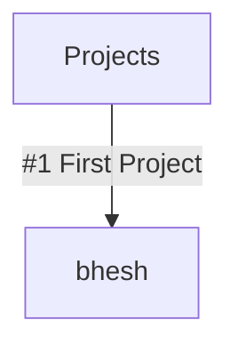

# Profile Github ✨
Welcome to the cave and to my lounge. Here, you will find humble creations that I enjoy making!
- 🌱 Learning and growing every day!

```diff
- Give up, you're not talented enough.
+ Talents are worthless without hard work.
```

__Projects__: #1 [](https://github/bhenzyldave/bhesh)

__Known Languages:__ 


#
